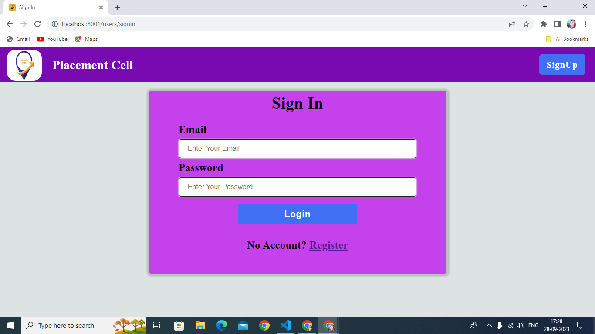
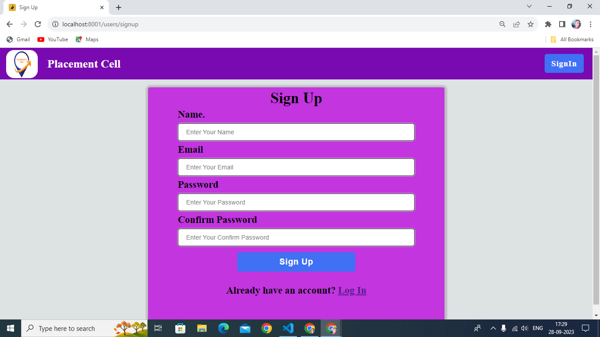
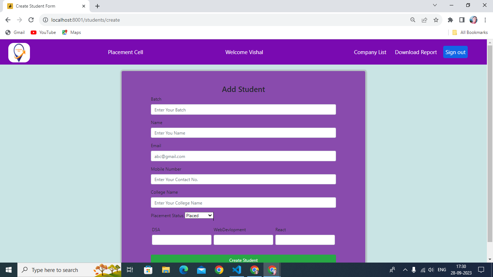
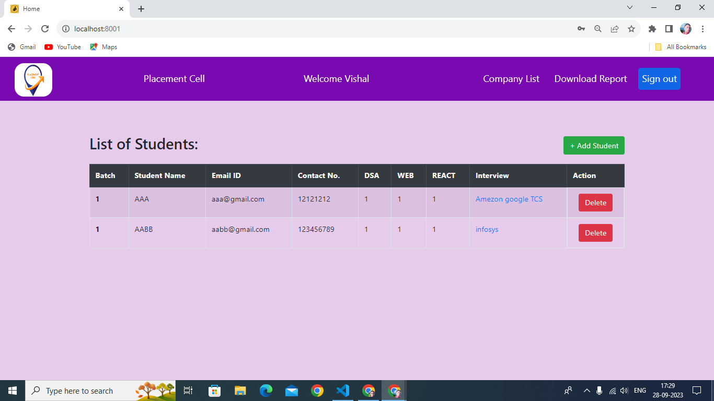
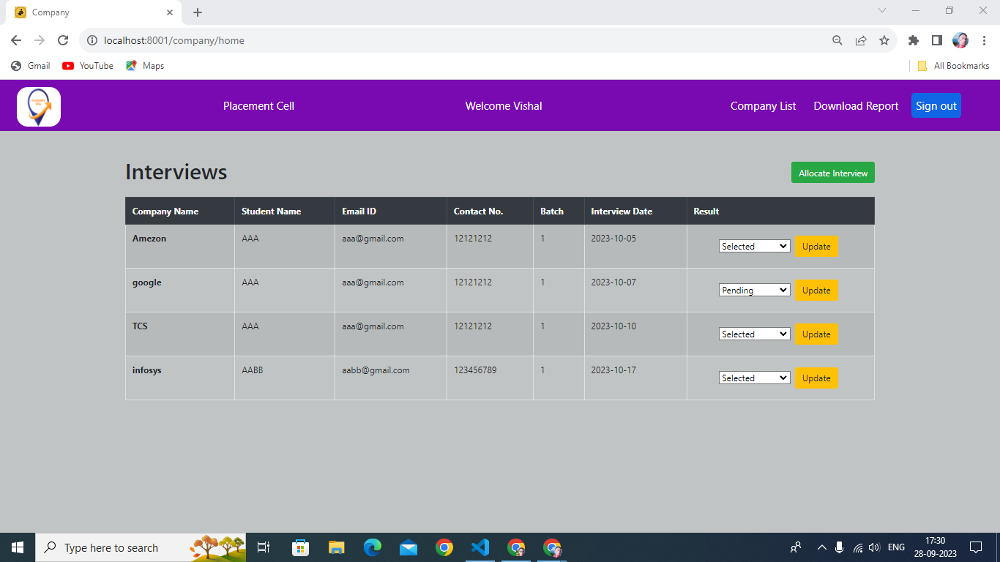
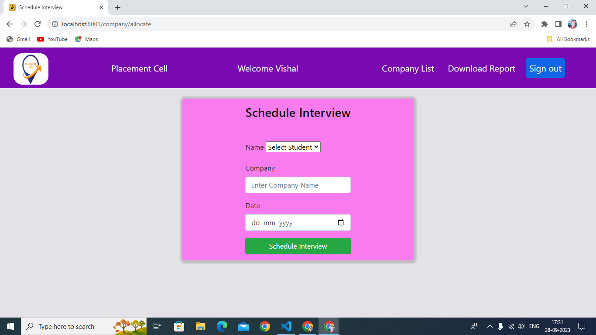

# Placement Cell In NodeJs

### You click Go Live and see live🥰 [Go Live](https://placement-poll.onrender.com/users/signin)

<h1 align="center">Placement Cell</h1> 

  ✍ This is interface for the employees to fill in the data into the database and company allocate the intervies in a paticular time and also update the interviews information then download it in CSV format.

<h1>Project Setup</h1>

### Run `npm install` to install required dependencies:
- bcrypt 
- connect-flash
- dotenv
- ejs
- express
- express-session
- fast-csv
- fs for security purpuse
- mongodb
- mongoose
- passport
- passport-local 
- etc
## Folter Structure
- ### assets
    - ##### CSS
        - bootstarp_css
        - header
        - signin
        - signup
    - #### images
      - addStudent.png
      - interviewSchdule.png
      - interviewsList.png
      - signIn.png
      - signup.png
      - studentList.png
    - #### js
      - bootstrap_javascript
- ### config
    - flash
    - mongoose
    - passport-local-startegy
- ### controller
    - companyController
    - homeController
    - studentController
    - userController
- ### models
    - CompanySchema
    - studentSchema
    - userSchema
- ### report
    - data.csv formet
- ### routes
    - companyRoutes
    - index
    - studentRoutes
    - userRoutes
- ### views
    - -header
    - add_student
    - allocateInterview
    - company
    - home
    - signin
    - signup
- ### index
- ### package.json
- ### README.md
## Features

- Sign In/Log In form for employees
- Sign Up form for employees
- Student adition form
- Students interview Allocation form
- Interviews result updation form
- Download reports of students in csv format

### This project runs on the port number [localhost: 8001]()

# Screenshots of the pages

## Sign In Form
  
  
## Sign Up Form
  

## Add Student Page
  

## Student Page 
  

## Interview Page
  

## Interview Scheduling Page
  
